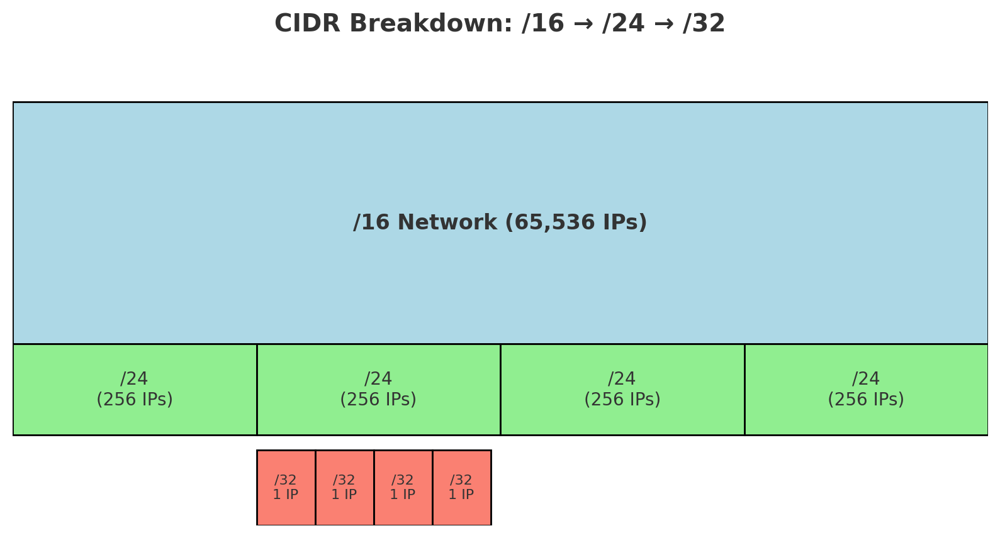

# 📘 CIDR Made Simple

## 🔹 What is CIDR?
CIDR (**Classless Inter-Domain Routing**) is a shorthand way to represent a **range of IP addresses**.  
Instead of writing each address one by one, we use **IP + /prefix**.

Example:
```
192.168.1.0/24
```
This means **all IPs from 192.168.1.0 to 192.168.1.255**.

---

## 🔹 How CIDR Works
Every IPv4 address has **32 bits**.

- The **`/number`** after an IP tells how many bits are **fixed (network)**.  
- The remaining bits are **free (hosts)**.

### Examples
- `/32` → Only **1 IP** (all 32 bits fixed).  
- `/24` → **256 IPs** (first 24 bits fixed, last 8 bits vary).  
- `/16` → **65,536 IPs** (first 16 bits fixed, last 16 bits vary).  

👉 Formula:  
```
Number of IPs = 2^(32 - prefix_length)
```

---

## 🔹 Quick Analogy
Think of it like **addresses in a city**:

- `/32` → One house 🏠  
- `/24` → One street (256 houses) 🏘️  
- `/16` → One town (65,536 houses) 🏡🏡🏡  
- `/8` → One big city 🌆  

---

## 🔹 CIDR Cheat Sheet (IPv4)

| CIDR | # of IPs | Example Range | Analogy |
|------|----------|---------------|---------|
| `/32` | 1 | `192.168.1.5` only | One house 🏠 |
| `/24` | 256 | `192.168.1.0 – 192.168.1.255` | One street 🏘️ |
| `/16` | 65,536 | `192.168.0.0 – 192.168.255.255` | Town 🏡🏡 |
| `/8`  | 16M | `10.0.0.0 – 10.255.255.255` | Big city 🌆 |

*(and so on, see full table in notes)*

---

## 🔹 Visual Breakdown

A `/16` network can be split into multiple `/24`s, and each `/24` can be split into `/32`s:

```
/16 (65,536 IPs) → Town
   ├── /24 (256 IPs) → Streets
       ├── /32 (1 IP) → Houses
```



---

## 🔹 Subnetting Example
Suppose you have a **VPC with 10.0.0.0/16** (65,536 IPs):

- Divide it into **subnets**:  
  - `10.0.1.0/24` → Public subnet (256 IPs)  
  - `10.0.2.0/24` → Private subnet (256 IPs)  
  - `10.0.3.0/24` → Database subnet (256 IPs)  

Each subnet is a smaller slice of the bigger `/16`.

---

## ✅ Summary
- CIDR = **IP + prefix** (how many bits are network vs host).  
- Bigger prefix (e.g., `/32`) → smaller network.  
- Smaller prefix (e.g., `/8`) → larger network.  
- Useful for **VPCs, subnets, routing, and firewall rules**.
